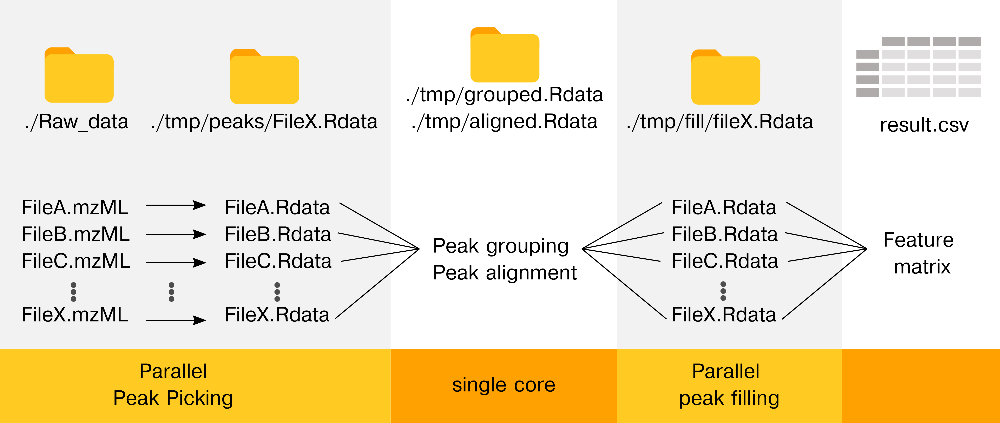

<!-- README.md is generated from README.Rmd. Please edit that file -->

```{r, include = FALSE}
knitr::opts_chunk$set(
  collapse = TRUE,
  comment = "#>",
  fig.path = "man/figures/README-",
  out.width = "100%"
)
```

# cXCMS

<!-- badges: start -->
<!-- badges: end -->

The goal of cXCMS is to provide the framework for efficient high performance computing (HPC) untargeted LCMS data pre-processing. Also, the package memory optimizes the workflow in laptops environments (MacOS or Windows), allowing preprocessing of larger sample sizes on small PCs. The source code has been used for the project [Large-Scale metabolomics: Predicting biological age using 10,133 routine untargeted LC-MS measurements](\https://doi.org/10.1111/acel.13813).

Important notes about the package:
0. The preprocessing only works on MS1 data. If MS2 data are needed use regular xcms.
1. cXCMS reduces memory(ram) by processing files in parallel and/or sequentially.
2. Already peak called files do not have to be recalled, if new data are added.
3. The CPU time is actually (slightly) worse than xcms as files must be read and saved to disk.
4. To fully exploit the parallel functionality, use computional workflows (e.g., snakemake or gwf).
5. New peak picking softwares are continously published and we would like to refer to MZmine and OpenMS as they are faster per file (but haven't been tested on large-scale untargeted data)


### Installation

You can install the development version of cXCMS from [GitHub](https://github.com/) with:

``` r
# install.packages("devtools")
devtools::install_github("johanLassen/cXMS")
```

### Overview

The cluster xcms package is dependent on the regular xcms package. We aim to make as few changes as possible to ease the use and maintenance of the package.

```{r example, warning=F, error=F, message=F}
library(cXCMS)
library(xcms)
#BiocManager::install("xcms")
library(tidyverse)
```

Here's the idea behind the package: The workflow makes the peak picking and the peak integration parallel to (1) reduce memory consumption and (2) improve support for multi-node high performance cluster processing. The first achievement benefits all workflows by lowering memory requirements, while the second achievement allows parallelization. All of the processes are orchestrated by a simple metadata data frame that we will describe below.

##### Workflow


## Setting up for success

```{r}
files <- "~/Documents/lcms_exampledata"
peak_folder <- paste0(files, "/peaks_identified/")
dir.create(peak_folder)

(processing_info <- 
  tibble(file_name       = list.files(files, full.names = F), # get only the file names
         sample_name     = gsub("[.].*", "", file_name), # remove the file type from file names to get sample name
         full_path       = list.files(files, full.names = T), # get the full path of the files
         base_directory  = files,
         peak_called     = paste0(peak_folder, sample_name, "_peaksIdentified.Rdata"), # name the outputs of the peak identification
         collected_peaks = paste0(base_directory, "/peaks_identified.Rdata") # File that should contain all samples of the peak picking (constant vector)
         ) 
)
# Ensure all input files are mzML files
processing_info <- processing_info[grepl("mzML|mzXML", processing_info$file_name),]

```

# Peak detection

This step loads the mzML files and detects the peaks using the centwave algorithm. The centwave parameters must be provided to make the function run. We would never recommend using the default parameters as [expert and automatic parameter selection are better](\https://doi.org/10.1021/acs.analchem.1c02000).

One file is approximately processed in 3 minutes and use ~3-4 GB. The time depends on the size of the files and the computer.
```{r}

cwp <- CentWaveParam()

for (row in 1:nrow(processing_info)){
  print(paste0("Calculating file: ", row, " of ", nrow(processing_info)))
  input  <- processing_info$full_path[row]
  output <- processing_info$peak_called[row]
  cXCMS::cFindChromPeaks(input = input, output = output, cwp = cwp)
}

```

# Collect the peak called files
```{r}
collect_files(processing_info$peak_called, output = processing_info$collected_peaks)
```


# Peak grouping
```{r}
load(processing_info$collected_peaks[1])
pdp <- xcms::PeakDensityParam(sampleGroups=xset_peaksIdentified@phenoData@data$group,
                        bw           = 10, 
                        minFraction  = 0.5)

xset_grouped_first <- groupChromPeaks(xset_peaksIdentified, param=pdp)
```

# Alignment
```{r}
###################################### VIZ result ##############################################

args               <- commandArgs(trailingOnly=TRUE)
xset_grouped_first <- args[1]
load(xset_grouped_first)#"./tmp/xset_grouped_first.Rdata")
object <- xset_grouped_first; rm(xset_grouped_first)

msLevel <- 1
param <- PeakGroupsParam(smooth = "loess",
                         minFraction	= 0.5,
                         span = 0.25,
                         extraPeaks = 250, # for full dataset 200 does not work
                         family = "gaussian")

xset_aligned <- adjustRtime(object, param)
xset_aligned <- applyAdjustedRtime(xset_aligned)


save(xset_aligned, file = "./tmp/xset_aligned.Rdata")

```


