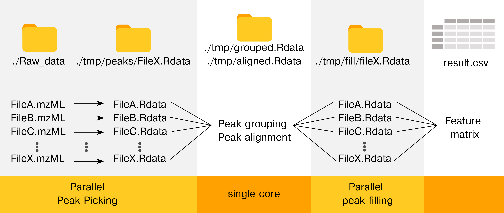

```{r, include = FALSE}
knitr::opts_chunk$set(
  collapse = TRUE,
  comment = "#>",
  fig.path = "man/figures/README-",
  out.width = "100%"
)
```

# cXCMS

The goal of cXCMS is to provide the framework for efficient high performance computing (HPC) untargeted LCMS data pre-processing. Also, the package memory optimizes the workflow in laptops environments (MacOS or Windows), allowing preprocessing of larger sample sizes on small PCs. The source code has been used for the project [Large-Scale metabolomics: Predicting biological age using 10,133 routine untargeted LC-MS measurements](\https://doi.org/10.1111/acel.13813).

Important notes about the package:

0.  The preprocessing only works on MS1 data. If MS2 data are needed use regular xcms on a few samples.

1.  cXCMS reduces memory (RAM) by processing files in parallel and/or sequentially given ressources available.

2.  Already peak called files do not have to be recomputed, if new data are added.

3.  The CPU time is actually (slightly) worse than XCMS as files must be read and saved to disk. Use XCMS if everything fits into the memory.

4.  To fully exploit the parallel functionality, use computional workflows (e.g., snakemake or gwf).

5.  New peak picking softwares are continously published and we would like to refer to MZmine and OpenMS as they are faster per file (but haven't been tested on large-scale untargeted data)

### Installation

You can install the development version of cXCMS from [GitHub](https://github.com/) with:

``` r
# install.packages("devtools")
devtools::install_github("johanLassen/cXCMS")
```

This should work without major errors. We also refer to the HPC workflow (see articles).

### Overview

The cXCMS package is dependent on the regular XCMS package as ee aim to make as few changes as possible to ease the use and maintenance of the package.

```{r example, warning=F, error=F, message=F}
library(cXCMS)
library(xcms)
library(tidyverse)
```

Here's the idea behind the package:

The workflow makes the peak picking and the peak integration parallel to

-   Reduce memory consumption

-   Improve support for multi-node high performance cluster processing.

Hence, we can reduce memory usage in all setups (local computing and HPC) and improve processing times in HPC through parallelization.

##### Figure 1 \| Workflow



## Running the workflow using HPC

See [article](https://johanlassen.github.io/cXCMS/articles/HPC_workflow.html) about HPV workflows.

## Running the workflow locally

### STEP 1 - Peak Identification

#### 1. Defining the mzML files of our experiment (from msdata package)

```{r}
data_files <- dir(system.file("sciex", package = "msdata"), full.names = TRUE)
data_files
```

On your system, you might want something like this:

```         
data_folder <- "~/path/to/experiment"
data_files <- list.files(data_folder, recursive=TRUE, full.names=TRUE)
```

Once we have the paths to each of the files we can continue

## 2. Setting output files

note that it is strongly advised to use .rds as file suffix although all names should work

```{r}
peak_directory <- "./tmp/peak_picked"
dir.create(peak_directory, recursive = TRUE, showWarnings = FALSE)

peak_files <- paste0(peak_directory, gsub(".*/", "/", data_files))
peak_files <- gsub(".mzML", ".rds", peak_files)
peak_files <- gsub("-", "_", peak_files)

peak_files
```

## 3. Running peak picking on one file at a time

```{r}

# Set the peak picking parameters
cwp <- CentWaveParam()

for (i in seq_along(data_files)){
  input  <- data_files[i]
  output <- peak_files[i]
  
  # if file exists continue
  if (file.exists(output)) next
  
  cXCMS::cFindChromPeaksStep1(input = input, output = output, cwp = cwp)
}

```

## 4. Merging peak picked files prior to peak grouping

This step has been highly optimized compared to previous methods, reducing running time from nlog(n) to n. In practice this does not matter for less than 1000 samples, but in the range of 5000-10000 samples we go from days to hours in processing time. In the +10000 sample range the old method was not viable at all. This function uses the exact same function as the original method but uses a workaround to avoid redundant checks.

```{r}

output_peak_identified <- "./tmp/peak_picked_dataset.rds"
cFindChromPeaksStep2(inputs = peak_files, output = output_peak_identified)

```

## Grouping 1

```{r}

msobject <- readr::read_rds(output_peak_identified)
pdp      <- xcms::PeakDensityParam(sampleGroups = msobject@phenoData@data$group)
msobject <- groupChromPeaks(msobject, pdp)

```

## Alignment

```{r}
pgp      <- xcms::PeakGroupsParam()
msobject <- adjustRtime(msobject, pgp)
```

## Grouping 2

```{r}
pdp      <- xcms::PeakDensityParam(sampleGroups = msobject@phenoData@data$group)
msobject <- groupChromPeaks(msobject, pdp)

output_integration_ready <- "./tmp/integration_ready.rds"
readr::write_rds(msobject, output_integration_ready)
```

## Integration

This is the most memory consuming step in the analysis. Both in the original xcms and this HPC optimized version.

```{r}
fcp           <- FillChromPeaksParam(expandMz = 0, expandRt = 0)
output_step1  <- "./tmp/integration_package.rds"
prepared_data <- cXCMS::cFillChromPeaksStep1(input = output_integration_ready, fcp = fcp, output = output_step1)
```

### Extracting peaks from the spectras

This is the memory intensive step. Beware that it will always rerun all files as the peaks depend on previous steps

```{r}
# Change subdir from peak_picked to integrated for the output files (n=sample size) of cFillChromPeaksStep2 step
integration_files <- gsub("peak_picked", "integrated", peak_files)

for (i in seq_along(integration_files)){
  cFillChromPeaksStep2(input = output_step1, output = integration_files[i], index = i)
}

```

```{r}
output <- "./tmp/preprocessing_output.rds"
cFillChromPeaksStep3(inputFromStep1 = output_step1, inputFromStep2 = integration_files, output = output)
```

## Output of preprocessing

```{r}

ms_preprocessed <- read_rds(output)
feature_name   <- 
  xcms::featureDefinitions(ms_preprocessed) |> 
  as_tibble() |> 
  mutate(feature_name = paste0("M", round(mzmed), "T", round(rtmed)),
         feature_name = make.unique(feature_name)) |> 
  pull(feature_name)

feature_values  <- 
  xcms::featureValues(ms_preprocessed) |> 
  as_tibble() |> 
  mutate(feature_name = feature_name) |> 
  pivot_longer(cols = -feature_name) |> 
  pivot_wider(names_from = feature_name, values_from = value) 

```
